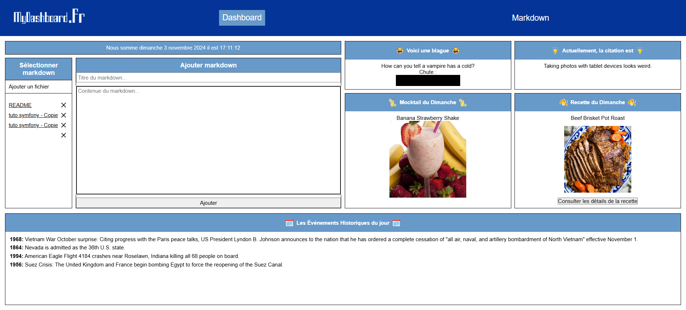

# 📝 Projet React - Éditeur Markdown

Site Web : https://my-dashboard-markdown.netlify.app

## 📖 Description
Ce projet est un éditeur Markdown en React qui propose une interface "old school" pour le tableau de bord, incluant plusieurs éléments fun comme une blague du jour, une citation, et des évènements historiques du jour. Il comprend deux pages principales : un tableau de bord et une page d'édition pour les fichiers Markdown.

## ✨ Fonctionnalités
- Tableau de bord avec citations, blagues, et événements historiques.
- Éditeur de fichiers Markdown avec options d'import/export.

## Page Tableau de Bord

| 🛠️ Fonctionnalités |   📌 Disponibilité     | 💬 Commentaire       |
|:--------------- |:-------------------:|:-----------------:|
| - 🗓️ Affichage de la date et l'heure | ✅|                  |
| - 💡 Citation  du jour               | ✅| ( Via une API )      |
| - 😆 Blague  du jour  |    ✅   | ( Via une API )   |
| - 📜 Évènements historiques du jour   |    ✅   | ( Via une API )     |
| - 🍹 Mocktail  du jour  |    ✅   | ( Via une API )    |
| - 🍽️ Recette  du jour  |    ✅   | ( Via une API )    |
| - 📝Liste des fichiers Markdown  |    ✅   | créés par l’utilisateur avec possibilité d'édition   |

## Page d'Édition de Fichier Markdown
| 🛠️ Fonctionnalités |   📌 Disponibilité     | 💬 Commentaire       |
|:--------------- |:-------------------:|:-----------------:|
| - ✏️ Édition et prévisualisation en HTML du fichier Markdown | ✅| |
| - 📤 Exportation du fichier en .md  | ✅|       |
| - 📥 Importation de fichier .md  |    ✅ | existant pour édition   |

## 🌟 Fonctionalités Bonus
| 🛠️ Fonctionnalités |   📌 Disponibilité     | 💬 Commentaire       |
|:--------------- |:-------------------:|:-----------------:|
| - 🎉 Ajout des émojis des année 2000 | ✅| |
| - 📱 Full Responsive | ✅| |
| - 🗑️ Ajout d'un button Supprimer | ✅ | Button supprimer pour un fichier ReadMe.Md |
| - 🖼️ Ajout des images dans Mocktail et Recettes | ✅ | |
| - 📌 Ajout de la ClassActive dans la Nav | ✅ | |
| - 🚀 déploiment du projet| ✅ | (Via Netlify 🌐)|

## Installation
1. Cloner le dépôt : `git clone https://github.com/utilisateur/projet-react-markdown.git`
2. Installer les dépendances : `npm install`
3. Lancer le projet : `npm run dev`

## Technologies

- 
- 
- 
- 

## Ressources et APIs

* **Citations :** [API Advice](https://api.adviceslip.com/advice) - Fournit des citations aléatoires en anglais.
* **Blagues :** [Official Joke API](https://official-joke-api.appspot.com/random_joke) - Fournit des blagues aléatoires en anglais.
* **Événements historiques :** [Muffin Labs History API](http://history.muffinlabs.com/date) - Affiche des événements historiques ayant eu lieu un jour donné.
* **Mocktails :** [The Cocktail DB (Non-Alcoholic)](https://www.thecocktaildb.com/api/json/v1/1/filter.php?a=Non_Alcoholic) - Fournit une liste de cocktails sans alcool.
* **Recettes :** [The Meal DB](https://www.themealdb.com/api/json/v1/1/random.php) - Fournit une recette aléatoire en anglais.

## Membres du Groupe
- [DE PASQUAL Eddy Jean Christopher](https://github.com/christopherDEPASQUAL) - Développeur front
- [Codandabany Devanandhan](https://github.com/MrDevaa) - Développeur front
- [DESCARPENTRIES Stéphane](https://github.com/Woodiss) - Développeur front   
- [DA ROCHA Hugo](https://github.com/Hugodrc55) - Développeur front 

## 💬 Remerciements

Un grand merci à Mr Damien pour ce projet stimulant et enrichissant !

© 2024 Groupe 3 - Projet React Hetic - Web2 . All rights reserved.

